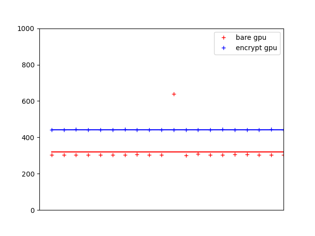

# Enchecap


An **enc**rypted (**enc**lave-based) **he**terogeneous **ca**lculation **p**rotocol based on Nvidia CUDA and Intel SGX with a simple sample of CUBLAS, designed and implemented by [Tinghao Xie](http://vtu.life), [Haoyang Shi](https://github.com/Luke-Skycrawler), [Zihang Li](https://github.com/zjulzhhh).

Enchecap illustration:


Enchecap illustration (with **protected** and **trusted** regions):


Enchecap performance:


---

To **build** the project, you'll need to install and configure:
* SGX SDK
* CUDA Toolkit
* CUDA Samples

, then set your `CUDA_PATH` and `INCLUDES` in Makefile, and make sure your SGX environment activated by

```bash
source /PATH_OF_SGXSDK/environment
```

(check SGX SDK official [site](https://01.org/intel-software-guard-extensions) for more details)

Then build with:

```bash
make # SGX hardware mode
```

```bash
make SGX_MODE=SIM  # SGX simulation mode
```

(check README_SGX.txt for more details)

> Your linux OS version might be limited by SGX SDK, check https://01.org/intel-software-guard-extensions for more details. We're using Ubuntu 18.04 x86_64, and cannot guarantee it work successfully on other platforms. We are also compiling with gcc version 7.5.0 and nvcc v11.1, which do not pose such strict limitations compared to Intel SGX.

---

To **run** the project, you'll need to install and configure correctly:
* SGX PSW
* SGX driver, if you build it in hardware mode and that your CPU & BIOS support SGX
* CUDA Driver (of course you must have an Nvidia GPU)

Run with:

```bash
./app
```

## TODO

**Notice**: We have not implemented the user-server code into the library/sample now, since it's similar to the host-device part of our protocol. For now, we just implement the host-device part. In this repository, we show how to wrap up the `cudaMemcpy()` into `secureCudaMemcpy()`, doing implicit en/decryption for handy secure deployment.

### Phase I: Initialization
- [x] Create an enclave
- [x] Enclave generates its own keys (generation is yet an empty shell now), then broadcasts its public key to user & device
- [x] GPU generates its own keys (generation is yet an empty shell now), then broadcasts its public key to host & user

### Phase II: Calculation
- [x] En/Decrypt in enclave (decrypt with SGX's private key, encrypt with GPU's public key)
- [x] En/Decrypt on GPU (decrypt with GPU's private key, encrypt with SGX's public key)

### Future Work
- [ ] The GPU's and SGX's keys are both simply welded in the code currently, need FIX
- [ ] The current RSA en/decrypt algorithm is yet extremely naive! (further works include regrouping, big number supports...)
- [ ] Add the user-server part into the sample, including
    * Remote attestation with Intel SGX
    * Broadcast his/her public key to the enclave and GPU, meanwhile record their public keys
    * Send encrypted data to the server
    * Receive encrypted results from the server
- [ ] Intergration with real industrial work based on CUDA (like PyTorch)
- [ ] Intergration with a real trusted GPU (far from our reach now)
