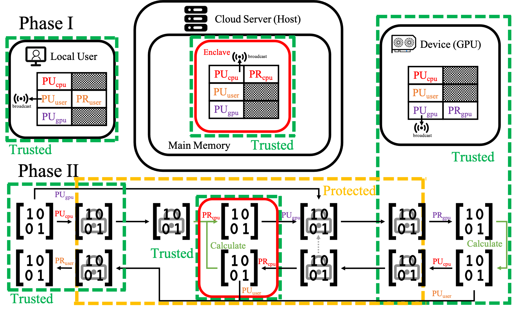

# Enchecap

An (onbuilding) **enc**rypted (**enc**lave-based) **he**terogeneous **ca**lculation **p**rotocol based on Nvidia CUDA and Intel SGX, designed and implemented by [Tinghao Xie](http://vtu.life), [Haoyang Shi](https://github.com/Luke-Skycrawler), [Zihang Li](https://github.com/zjulzhhh).

Enchecap illustration:


Enchecap illustration (with **protected** and **trusted** regions):


---

To **build** the project, you'll need to install and configure:
* SGX SDK
* CUDA Toolkit
* CUDA Samples

, then set your `CUDA_PATH` and `INCLUDES` in Makefile, and make sure your SGX environment activated by

```bash
source /PATH_OF_SGXSDK/environment
```

(check SGX SDK official [site](https://01.org/intel-software-guard-extensions) for more details)

Then build with:

```bash
make # SGX hardware mode
```

```bash
make SGX_MODE=SIM  # SGX simulation mode
```

(check README_SGX.txt for more details)

> Your linux OS version might be limited by SGX SDK, check https://01.org/intel-software-guard-extensions for more details. We're using Ubuntu 18.04 x86_64, and cannot guarantee it work successfully on other platforms. We are also compiling with gcc version 7.5.0 and nvcc v11.1, which do not pose such strict limitations compared to Intel SGX.

---

To **run** the project, you'll need to install and configure correctly:
* SGX PSW
* SGX driver, if you build it in hardware mode and that your CPU & BIOS support SGX
* CUDA Driver (of course you must have an Nvidia GPU)

Run with:

```bash
./app
```

## TODO

### Phase I: Initialization
- [x] 1. Create an enclave
- [ ] 2. Enclave generate its own keys
- [ ] 3. Key exchange between User and Enclave
- [ ] 4. GPU generate its own keys (there are bugs with the function, now replaced with a straw man)
- [x] 5. Key exchange between Enclave and GPU

### Phase II: Calculation
- [x] 6. En/Decrypt in enclave (with unsealed keys in enclave memory only)
- [x] 7. En/Decrypt on GPU (with keys in device memory only)

### Future Work
- [ ] Test the performance
- [ ] The user's keys are now simply welded in the code, need to finish TODO list 2 and 3
- [ ] The GPU's keys are now simply welded in the code, need to finish TODO list 4
- [ ] The current RSA en/decrypt algorithm is yet extremely naive! (further works include regrouping, big number supports...)
- [ ] Remote attestation with Intel SGX
- [ ] Intergration with real industrial work based on CUDA
- [ ] Find ways to protect data on GPU side (hardware)
